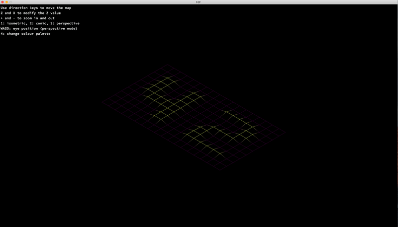
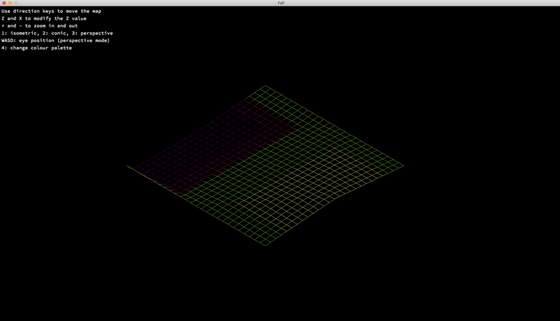

# FdF
## A simplified 3D graphic representation of a relief landscape.

This project is about creating a simplified graphic “wireframe; a representation of a relief landscape linking various points
(x, y, z) via segments.

